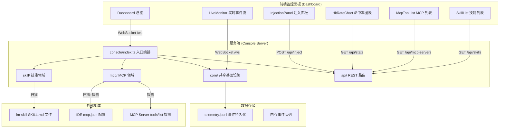
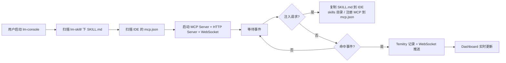

# 一、项目概述

| 维度 | 说明 |
| ---- | ---- |
| **项目名称** | lm-console |
| **项目定位** | 统一控制台，提供技能（SKILL.md）和 MCP 工具的注入、发现、监听和实时命中率监控能力 |
| **技术栈** | Node.js + TypeScript（服务端）、React + Vite（面板）、MCP 协议、WebSocket |
| **核心场景** | 开发者在 IDE（Qoder/Claude Code/VSCode/Copilot/OpenClaw）中注入技能和 MCP 配置，通过实时面板观测技能命中率和 MCP 工具调用频次 |

---

# 二、项目架构

> **填写说明：** 架构图和流程图使用 Mermaid 或 Draw.io 绘制，目录结构列出项目实际使用的目录。

## 架构图



## 流程图



## 目录结构

```
lm-console/
├── package.json                        # 项目配置
├── tsconfig.json                       # TypeScript 编译
│
├── console/                            # 服务端（10 文件）
│   ├── index.ts                        # 入口：MCP + HTTP + WS 编排
│   ├── core/
│   │   ├── types.ts                    # 公共类型定义
│   │   ├── telemetry.ts                # 统一遥测收集
│   │   ├── ws-server.ts                # WebSocket 推送
│   │   └── path-resolver.ts            # 跨平台路径解析
│   ├── skill/
│   │   ├── registry.ts                 # SKILL.md 扫描解析
│   │   └── injection.ts                # 技能注入 IDE
│   ├── mcp/
│   │   ├── registry.ts                 # mcp.json 发现 + 工具探测
│   │   └── injection.ts                # MCP 注册到 IDE
│   └── api/
│       └── routes.ts                   # REST API 路由
│
├── dashboard/                          # 面板（13 文件）
│   ├── index.html                      # SPA 入口
│   ├── package.json / tsconfig.json
│   ├── vite.config.ts                  # Vite 配置 + API 代理
│   └── src/
│       ├── index.tsx                   # React 挂载
│       ├── App.tsx                     # 主布局 + 侧边导航 + WS 连接
│       ├── types.ts                    # 前端类型定义
│       ├── skill/SkillList.tsx         # 技能列表页
│       ├── mcp/McpToolList.tsx         # MCP 工具列表页
│       └── shared/
│           ├── Dashboard.tsx           # 总览面板
│           ├── HitRateChart.tsx        # 命中率图表
│           ├── InjectionPanel.tsx      # 注入控制台
│           └── LiveMonitor.tsx         # 实时事件流
│
└── scripts/
    ├── inject-qoder.sh                 # 技能批量注入 Qoder
    └── lm-mcp-exec.sh                  # MCP 调用包装器
```

# 三、技术选型

| 维度 | 方案 | 版本 | 说明 |
| ---- | ---- | ---- | ---- |
| **构建工具** | Vite | 5.x | 前端构建，HMR 热更新 |
| **框架** | React + TypeScript | 18.x / 5.x | 前端 SPA 面板 |
| **服务端运行时** | Node.js + tsx | 20.x / 4.x | 后端 MCP + HTTP 服务 |
| **状态管理** | React useState/useEffect | - | 面板状态通过 WebSocket 实时推送，无需全局 Store |
| **图表** | 纯 CSS | - | 命中率图表用 div 模拟柱状图，避免引入 Chart 库 |
| **WebSocket** | ws | 8.x | 服务端实时推送命中事件 |
| **MCP SDK** | @modelcontextprotocol/sdk | 1.x | MCP 协议实现 |
| **样式方案** | Inline Style | - | 深色主题，CSS-in-JS 手写 |
| **YAML 解析** | gray-matter | 4.x | 解析 SKILL.md 的 YAML frontmatter |
| **参数校验** | zod | 3.x | MCP tool 入参校验 |
| **文件扫描** | glob | 10.x | 扫描 SKILL.md 文件 |

# 四、路由设计

> **填写说明：** 列出项目全部路由路径、对应页面和权限要求。路由模式根据项目实际情况选择。

Dashboard 采用 SPA 单页结构，通过标签页切换内部组件，无 URL 路由。

| 标签页 | 组件 | 说明 |
| ------ | ---- | ---- |
| 总览 | `shared/Dashboard.tsx` | 技能+MCP 双维度统计卡片、Top5 排行、最近事件 |
| 技能 | `skill/SkillList.tsx` | 按分类浏览所有 SKILL.md 元数据 |
| MCP | `mcp/McpToolList.tsx` | 展示发现的 MCP 服务器及工具，可主动探测 |
| 图表 | `shared/HitRateChart.tsx` | 命中率柱状图和详细统计表 |
| 注入 | `shared/InjectionPanel.tsx` | 技能/MCP 注入表单（IDE 选择 + 层级选择） |
| 实时 | `shared/LiveMonitor.tsx` | WebSocket 实时事件流 |

# 五、状态管理

> **填写说明：** 列出每个 Store 的消费者、依赖字段和用途。页面私有状态放页面目录，仅跨页面共享的状态放入全局 `stores/`。

本项目为控制台工具，无全局状态管理库。数据流通过 WebSocket + React 本地状态实现。

## 使用矩阵

| 消费者 Store | 依赖的 Store | 依赖字段 | 说明 |
| ------------ | ------------ | -------- | ---- |
| `App.tsx` | 服务端 Telemetry | `stats`, `recent` | WebSocket 接收后分发给子组件 |

## Store 

本项目无 Zustand Store。状态通过 `App.tsx` 的 `useState` 本地管理，WebSocket 接收 `init` 或 `hit` 事件后更新状态，通过 props 下发到子组件。

```typescript
// App.tsx 中的核心状态
const [stats, setStats] = useState<Record<string, HitStats>>({});
const [recent, setRecent] = useState<HitEvent[]>([]);
const [connected, setConnected] = useState(false);
```

## Storage

| Key | 内容 | 存储方式 | 过期策略 | 说明 |
| --- | ---- | -------- | -------- | ---- |
| `telemetry.jsonl` | 命中事件日志 | 文件系统 (`~/.lm-console/`) | 按行追加，内存限 5000 条 | 服务端持久化，断连后恢复 |

# 六、UI设计

> **填写说明：** 填写项目的设计规范（色彩、字体、间距等）和交互反馈标准。如有设计系统文档可直接引用。

## 设计规范

| 维度 | 规范 | 说明 |
| ---- | ---- | ---- |
| 色彩系统 | 背景 `#0f172a`，卡片 `#1e293b`，主色 `#38bdf8`，强调 `#a78bfa` | 暗色主题，高对比度，区分 Skill（蓝）和 MCP（紫） |
| 字体系统 | `-apple-system, BlinkMacSystemFont, 'Segoe UI', Roboto, sans-serif` | 系统原生字体 |
| 间距系统 | 基础间距 0.25rem，布局使用 `gap` + `padding` | 弹性布局 |
| 圆角规范 | 卡片 12px，按钮/输入框 8px，标签 4px | 统一圆角层级 |
| 阴影规范 | 无阴影，使用边框 `#334155` 区分层级 | 扁平化风格 |

## 页面布局

```
┌───────────────────────────────────────────────────────────┐
│  🧠 lm-console    │  📊 总览 │  📋 技能 │  🛠️ MCP │ ...  │
├───────────────────┼───────────────────────────────────────┤
│                   │                                       │
│  📊 总览          │  总命中次数  今日命中  技能数  MCP数  │
│  📋 技能          │  ┌─────────────────────────────────┐  │
│  🛠️ MCP          │  │  🧠 技能 Top 5  │  🔧 MCP Top 5 │  │
│  📈 图表          │  └─────────────────────────────────┘  │
│  🔌 注入          │                                       │
│  ⚡ 实时          │  ⏱ 最近事件                            │
│                   │  ✅ gitnexus-exploring via mcp 14:23  │
│  ● 已连接         │  ✅ gitnexus.query via mcp  14:23    │
│                   │                                       │
└───────────────────┴───────────────────────────────────────┘
  ← 200px 侧边栏 →  ←              flex: 1                →
```

## 组件状态规范

| 状态 | 展示内容 | 触发条件 |
| ---- | -------- | -------- |
| 加载中 | 文字提示「加载中...」/「等待事件...」 | API 请求发起时，首次数据加载 |
| 空状态 | 灰色提示 + 引导文案（「暂无数据」「暂无事件」） | 列表无数据、统计为零 |
| 错误状态 | 红色 Tag + 错误信息文本 | MCP 探测失败、API 请求异常 |
| 成功状态 | 绿色左侧边框 + ✅ 图标 | 操作成功完成、事件成功命中 |

## 交互反馈规范

| 交互类型 | 反馈方式 | 持续时间 | 说明 |
| -------- | -------- | :------: | ---- |
| 注入操作 | 注入结果列表（✅/❌ 状态） | 持久 | 注入面板底部展示每条注入结果 |
| 探测操作 | 按钮禁用「探测中...」+ 结果更新 | 探测期间 | MCP 工具探测时按钮不可用 |
| WebSocket 连接 | 侧边栏底部状态指示灯 | 持续 | 绿色「已连接」/ 红色「断开」（3s 自动重连） |
| 实时事件 | 事件行滑入动画 + 左侧颜色边框 | 300ms 动画 | 新事件自动插入列表顶部 |

# 七、公共依赖

> **填写说明：** 集中列出项目涉及的公共（跨模块复用）Store、hooks、utils、constants、UI 样式模块，不重复展开设计细节。没有可删除本章节。

## 公共 Store

> Store 的详细设计见「# 五、状态管理」，本表仅列出跨模块共享的 Store 清单。

| Store | 关键字段 | 使用模块 | 依赖 Store | 说明 |
| ------ | -------- | -------- | ---------- | ---- |
| App 状态 | `stats, recent, connected` | 全部 5 个子组件 | 无 | WebSocket 驱动 |

## 公共 hooks

| Hook | 用途 | 使用模块 | 依赖 |
| ---- | ---- | -------- | ---- |
| 无 | 未提取公共 Hook | - | - |
面板组件直接使用 React `useState` / `useEffect`，未封装通用 Hooks。

## 公共 utils

| 函数 | 用途 | 使用模块 |
| ---- | ---- | -------- |
| `readBody()` (console/api/routes.ts) | 解析 HTTP 请求体 | API 路由 |

## 公共 constants

| 常量 | 值 | 用途 | 使用模块 |
| ---- | --- | ---- | -------- |
| `IDE_LIST` | Qoder / Claude Code / VSCode / Copilot / OpenClaw | 注入面板的 IDE 勾选列表 | `InjectionPanel.tsx` |
| `TABS` | 6 个标签页配置 | 侧边导航栏 | `App.tsx` |

## 公共 UI 样式

| 样式模块 | 用途 | 使用模块 |
| -------- | ---- | -------- |
| 无 | 全部使用 Inline Style | - |

# 八、公共组件设计

> **填写说明：** 仅列出跨页面复用、需要独立设计的公共组件。页面内部业务组件在 #11 业务组件明细表中展开。

## 使用矩阵

| 页面/功能 | Dashboard | SkillList | McpToolList | HitRateChart | InjectionPanel | LiveMonitor |
| --------- | :-------: | :-------: | :---------: | :----------: | :------------: | :---------: |
| 总览 | ✅ | - | - | - | - | - |
| 技能 | - | ✅ | - | - | - | - |
| MCP | - | - | ✅ | - | - | - |
| 图表 | - | - | - | ✅ | - | - |
| 注入 | - | - | - | - | ✅ | - |
| 实时 | - | - | - | - | - | ✅ |

## Dashboard 组件

```typescript
// dashboard/src/shared/Dashboard.tsx
interface DashboardProps {
  /** 技能和 MCP 的命中率统计 */
  stats: Record<string, HitStats>;
  /** 最近命中事件列表 */
  recent: HitEvent[];
}
```

展示 5 个统计卡片（总命中 / 今日 / 技能数 / MCP 工具数 / 平均成功率）、技能 Top 5、MCP Top 5 排行、最近 10 条事件。

## LiveMonitor 组件

```typescript
// dashboard/src/shared/LiveMonitor.tsx
interface LiveMonitorProps {
  /** 最近事件列表 */
  recent: HitEvent[];
  /** WebSocket 连接状态 */
  connected: boolean;
}
```

实时事件流面板：暂停/继续、清空、5 个小指标卡、事件行展示（时间＋类型图标＋技能名＋来源＋触发词＋耗时），左侧边框颜色区分：蓝=技能、紫=MCP、红=失败。

# 九、接口与数据定义

> **填写说明：** 先定义全局 API 接口规范（请求格式、响应结构、错误码），再列出接口规划表，最后展开各接口的详细参数和响应数据。

## API 接口规范

### 请求规范

| 规范项 | 说明 |
| ------ | ---- |
| 请求方式 | RESTful（GET / POST） |
| 基础路径 | 服务端 `http://localhost:3001`，Dashboard 通过 Vite Proxy 转发 |
| 请求头 | `Content-Type: application/json` |
| 参数传递 | GET 使用 Query 参数，POST 使用 Body（JSON） |

### 响应格式定义

```typescript
/** 统一 API 响应结构（通用） */
interface ApiResponse<T = unknown> {
  code: number;
  data: T;
  message: string;
}
```

### 错误码定义

| 错误码 | 含义 | 前端处理方式 |
| :----: | ---- | ------------ |
| `200` | 成功 | 正常解析 |
| `404` | 资源不存在 | 页面展示「未发现」 |
| `500` | 服务器内部错误 | 控制台打印错误 |

### 成功提示策略

非 CUD 类项目，无需统一成功提示策略。注入结果由 `InjectionPanel` 列表展示，命中事件由 `LiveMonitor` 实时展示。

## API 接口规划

| 接口路径 | 方法 | 使用模块 | 说明 |
| -------- | ---- | -------- | ---- |
| `/api/skills` | GET | `SkillList` | 获取所有技能元数据 |
| `/api/mcp-servers` | GET | `McpToolList` | 获取 MCP 服务器及工具列表 |
| `/api/probe` | POST | `McpToolList` | 探测单个 MCP 服务器的工具列表 |
| `/api/inject/skill` | POST | `InjectionPanel` | 注入技能到目标 IDE |
| `/api/inject/mcp` | POST | `InjectionPanel` | 注册 MCP 服务器到目标 IDE |
| `/api/record` | POST | 外部集成 | 手动记录命中事件 |
| `/api/stats` | GET | `Dashboard、HitRateChart` | 获取命中率统计 |
| `/api/recent` | GET | 初始化 | 获取最近事件 |
| `/health` | GET | 健康检查 | 服务存活检测 |

### GET /api/skills

#### 请求参数

| 参数名称 | 参数类型 | 是否必填 | 说明 |
| -------- | -------- | :------: | ---- |
| `category` | string | ✗ | 筛选技能分类 |

#### 响应数据

```typescript
interface SkillMetaResponse {
  name: string;
  description: string;
  category: string;
  filePath: string;
  triggers: string[];
  injectionTargets: string[];
}
```

### POST /api/inject/skill

#### 请求参数

| 参数名称 | 参数类型 | 是否必填 | 说明 |
| -------- | -------- | :------: | ---- |
| `skillName` | string | ✓ | 技能名称 |
| `targets` | string[] | ✓ | 目标 IDE 列表 |
| `scope` | `"global" \| "project"` | ✗ | 注入层级，默认 project |

#### 响应数据

```typescript
interface InjectResultResponse {
  target: string;
  type: "skill" | "mcp";
  name: string;
  status: "ok" | "skipped" | "error";
  targetPath: string;
  error?: string;
}
```

### WebSocket /ws 事件

| 事件 type | 方向 | 说明 |
| --------- | :--: | ---- |
| `init` | 服务端→客户端 | 连接建立后发送全量初始状态（stats + recent） |
| `hit` | 服务端→客户端 | 命中事件发生时推送单条事件 + 增量 stats |

# 十、核心技术设计

> **填写说明：** 记录项目中有技术难度或需要专门设计的关键实现，如地图渲染、文件分片上传、实时通信等。没有可删除本章节。

## 跨平台路径解析

### 技术方案

lm-console 支持 5 种 IDE 的全局和项目级注入，macOS 和 Windows 的全局路径差异大。通过 `PathResolver` 类统一封装：

- `os.homedir()` 获取用户主目录
- `os.platform()` 判断操作系统
- 全局路径：macOS 走 `~/Library/Application Support/...`，Windows 走 `~/AppData/Roaming/...`
- 项目路径：通过 `path.join(projectRoot, '.qoder/skills/')` 统一处理

```typescript
// console/core/path-resolver.ts
class PathResolver {
  skillDir(target: IdeTarget, scope: InjectScope, projectRoot: string): string {
    if (scope === 'project') {
      return path.join(projectRoot, '.qoder', 'skills');
    }
    return this.globalSkillDir(target); // 按 OS 返回不同路径
  }
}
```

## MCP 工具自动探测

### 技术方案

通过向 MCP 服务器发送 `tools/list` JSON-RPC 请求，实时获取其注册的工具列表：

```typescript
const request = JSON.stringify({
  jsonrpc: '2.0',
  id: 1,
  method: 'tools/list',
});
// 通过 stdio 发送到子进程，解析响应中的 tools 数组
```

探测过程：spawn 子进程 → 发送 `tools/list` → 解析 JSON-RPC 响应 → 格式化工具列表 → 关闭进程。

## 遥测与实时推送

### 技术方案

- `Telemetry` 继承 `EventEmitter`，实时记录命中事件
- 事件写入内存队列（最多 5000 条），每 5 秒异步持久化到 `telemetry.jsonl` 文件
- `TelemetryWsServer` 监听 `hit` 事件，广播到所有 WebSocket 客户端
- Dashboard 创建 WebSocket 连接后接收 `init`（初始化）和 `hit`（增量）事件，无需轮询

```typescript
// console/core/telemetry.ts
class Telemetry extends EventEmitter {
  record(event: Omit<HitEvent, 'timestamp'>): void {
    const ev = { ...event, timestamp: new Date().toISOString() };
    this.events.push(ev);
    this.emit('hit', ev); // 触发 WebSocket 广播
  }
}
```

## 权限控制方案

> **填写说明：** 描述项目前端权限控制的技术方案。没有可删除此节。

本项目为本地开发工具控制台，无用户权限系统，所有注入操作直接操作本地文件系统。

# 十一、核心功能模块

> **填写说明：** 先填写模块概览表（模块–页面–路由映射），再逐页面展开全部文档（页面架构、流程图、字段规格、交互规则、组件/hooks/utils/constants 矩阵）。

## 模块概览

| 模块 | 页面 | 路由 | 说明 |
|------|------|------|------|
| 监控面板 | 总览 | SPA 标签页 | 统计卡片 + 双维度排行 + 最近事件 |
| 监控面板 | 技能列表 | SPA 标签页 | 浏览所有 SKILL.md 元数据 |
| 监控面板 | MCP 列表 | SPA 标签页 | 浏览 MCP 服务器及工具 |
| 监控面板 | 命中率图表 | SPA 标签页 | 柱状图 + 详细统计表 |
| 监控面板 | 注入控制台 | SPA 标签页 | 技能/MCP 注入表单 |
| 监控面板 | 实时监控 | SPA 标签页 | WebSocket 实时事件流 |
| 服务端 | 技能注入器 | - | 解 SKILL.md → 复制到 IDE skills 目录 |
| 服务端 | MCP 注入器 | - | 解析 mcp.json → 合并注册 |
| 服务端 | 遥测收集 | - | EventEmitter + 文件持久化 |

---

## 总览面板

| 属性 | 内容 |
|------|------|
| 路由 | SPA 标签页「总览」 |
| 目标用户 | 开发者 |
| 功能概述 | 展示技能和 MCP 的命中率统计概览，包括统计卡片、排行和最近事件 |

### 页面架构

```
┌─────────────────────────────────────────────────┐
│  总命中次数 │ 今日命中 │ 技能数 │ MCP工具数 │ 成功率 │
│    12       │    3     │   8    │    4     │  95%  │
└─────────────────────────────────────────────────┘
┌─────────────────────┬───────────────────────────┐
│ 🧠 技能 Top 5       │ 🔧 MCP 工具 Top 5          │
│ #1 gitnexus-explore  │ #1 gitnexus.query         │
│ #2 brainstorming     │ #2 fetch.fetch            │
│ ...                  │ ...                       │
└─────────────────────┴───────────────────────────┘
┌─────────────────────────────────────────────────┐
│ ⏱ 最近事件                                       │
│ 14:23:01 ✅ gitnexus-exploring via mcp           │
│ 14:23:05 🔧 gitnexus.query via mcp              │
└─────────────────────────────────────────────────┘
```

### 交互规则

| 序号 | 操作 | 行为 |
| :--: | ---- | ---- |
| 1 | 切换标签页 | 侧边栏点击切换对应面板 |
| 2 | 查看 Top 5 | 自动按总命中次数降序排列 |
| 3 | 查看最近事件 | 自动从 WebSocket 接收最新 10 条 |

## 注入控制台

| 属性 | 内容 |
|------|------|
| 路由 | SPA 标签页「注入」 |
| 目标用户 | 开发者 |
| 功能概述 | 选择技能或 MCP，选择目标 IDE 和注入层级，一键执行注入 |

### 页面架构

```
┌─────────────────────────────────────────────────┐
│ 🔌 注入控制台                                    │
│                                                 │
│  [🧠 技能注入]  [🔧 MCP 注入]                    │
│  [📁 项目级]    [🌐 全局]  ←层级选择            │
│                                                 │
│  目标 IDE:                                       │
│  [✅ Qoder] [✅ Claude Code] [☐ VSCode] ...    │
│                                                 │
│  技能名称: [gitnexus-exploring       ] [🚀 注入] │
│                                                 │
│  注入结果:                                       │
│  ✅ gitnexus-exploring qoder → .qoder/skills/..  │
│  ✅ gitnexus-exploring claude → .claude/skills/. │
└─────────────────────────────────────────────────┘
```

### 交互规则

| 序号 | 操作 | 行为 |
| :--: | ---- | ---- |
| 1 | 切换注入模式 | 技能注入/MCP 注入，表单切换 |
| 2 | 选择 IDE | 多选，默认选中 Qoder + Claude Code |
| 3 | 选择层级 | 项目级或全局级，切换时说明路径 |
| 4 | 执行注入 | 调用 `/api/inject/skill` 或 `/api/inject/mcp` |
| 5 | 查看结果 | 注入结果列表展示（每条状态 + 目标路径）|

# 十二、开发规范

## 目录规范说明

| 目录 | 用途 | 规范 |
| ---- | ---- | ---- |
| `console/` | 服务端代码 | 按领域分包（core/ skill/ mcp/ api/），领域目录内拆分职责（registry/injection） |
| `console/core/` | 共享基础设施 | 不依赖业务领域，可被 skill 和 mcp 同时引用 |
| `console/skill/` | 技能领域 | registry 负责读（扫描 SKILL.md），injection 负责写（复制到 IDE） |
| `console/mcp/` | MCP 领域 | registry 负责发现 + 探测，injection 负责注册到 mcp.json |
| `dashboard/src/` | 前端面板 | 按领域分包（skill/ mcp/ shared/），组件文件与包同名 |
| `dashboard/src/shared/` | 共享面板组件 | 业务无关的通用组件（Dashboard、图表、注入、实时流） |
| `scripts/` | Shell 脚本 | 可独立执行的注入/包装脚本 |

## 组件命名规范

1. **服务端类命名**：大驼峰 PascalCase（`SkillRegistry`、`PathResolver`、`Telemetry`）
2. **方法命名**：小驼峰 camelCase（`injectSkill()`、`probeTools()`、`getStats()`）
3. **React 组件命名**：大驼峰 PascalCase（`Dashboard`、`LiveMonitor`、`InjectionPanel`）
4. **前端状态管理**：React 本地 `useState`，无全局 Store
5. **API 接口**：Restful，HTTP 方法映射操作语义（GET 查询、POST 写入）
6. **文件命名**：kebab-case（`ws-server.ts`），每个文件默认导出同一名称的类/函数

---

# 十三、构建与部署

> **填写说明：** 记录项目的环境配置、构建命令、关键环境变量和部署检查清单。

## 环境配置

| 环境 | 配置文件 | 说明 |
| ---- | -------- | ---- |
| 本地开发 | 无 | 环境变量或代码中直接指定 |

| 变量名 | 默认值 | 说明 |
| ------ | ------ | ---- |
| `LM_CONSOLE_PORT` | `3001` | 服务端 HTTP + WebSocket 端口 |
| `LM_SKILLS_DIR` | `/Users/zm/lm/lm-skill` | 技能源目录 |
| `LM_PROJECT_ROOT` | `process.cwd()` | 注入目标项目根目录 |

## 构建命令

```bash
# 安装依赖
cd /Users/zm/lm/lm-console && npm install
cd /Users/zm/lm/lm-console/dashboard && npm install

# 本地开发（终端 1：服务端）
npm run dev

# 本地开发（终端 2：面板）
npm run dashboard

# 生产构建
npm run build

# 技能注入
bash scripts/inject-qoder.sh /path/to/project
```

## 关键环境变量

| 变量名 | 说明 | 示例值 |
| ------ | ---- | ------ |
| `LM_CONSOLE_PORT` | 服务端端口 | `3001` |
| `LM_SKILLS_DIR` | 技能源目录 | `/Users/zm/lm/lm-skill` |
| `LM_PROJECT_ROOT` | 注入目标根目录 | `/Users/zm/lm/project` |
| `LM_CONSOLE_URL` | 上报地址（供脚本用） | `http://localhost:3001` |

## 部署注意事项

- [ ] 开发环境需同时启动服务端（3001）和面板（3002），面板通过 Vite Proxy 转发 `/api/*` 和 `/ws`
- [ ] 生产环境可构建静态资源到 `dashboard/dist/`，由服务端静态托管
- [ ] `LM_SKILLS_DIR` 路径需在运行环境中存在 SKILL.md 文件
- [ ] 全局注入操作本地文件系统（`~/.claude/skills/` 等），无需额外权限

# 十四、非功能性需求（NFR）

## 性能

| 指标 | 目标值 | 说明 |
| ---- | ------ | ---- |
| 首屏加载 | < 1s | Vite HMR 极速启动，无第三方库按需加载 |
| 事件推送延迟 | < 50ms | WebSocket 连接，服务端 emit 后立即广播 |
| 遥测队列容量 | 5000 条 | 内存上限，超过自动丢弃旧事件 |
| MCP 探测超时 | 5s | 单个 MCP 服务器探测超时 |

## 兼容性

| 维度 | 要求 | 说明 |
| ---- | ---- | ---- |
| 浏览器 | Chrome 90+ / Firefox 90+ / Safari 15+ | 基于 ES2020，无需 polyfill |
| Node.js | 18.x+ | MCP SDK 和 ESM 要求 |
| 操作系统 | macOS / Windows / Linux | `PathResolver` 自动适配路径格式 |

## 安全性

| 场景 | 措施 |
| ---- | ---- |
| 文件系统操作 | 只操作 `skills/` 和 `mcp.json` 等白名单路径 |
| 恶意技能注入 | 注入引擎仅复制 `SKILL.md`，不执行任何代码 |
| WebSocket 连接 | 本地开发环境，无外部网络暴露 |

## 用户体验

| 场景 | 要求 |
| ---- | ---- |
| 加载状态 | 首次请求展示「加载中...」文字提示 |
| 操作反馈 | 注入按钮禁用 + 结果列表展示 ✅/❌ 状态 |
| 空状态 | 无数据时展示「暂无数据」「未发现 MCP 服务器」等明确提示 |
| 连接断开 | 侧边栏显示「断开」红色状态灯，3 秒自动重连 |

# 十五、测试策略

> **填写说明：** 按测试类型列出覆盖范围、目标覆盖率和使用的工具。

| 测试类型 | 覆盖范围 | 目标覆盖率 | 工具 |
| -------- | -------- | ---------- | ---- |
| 单元测试 | `PathResolver` 路径解析、`Telemetry` 统计聚合 | - | 待选（vitest / jest） |
| 集成测试 | MCP Registry 的 `scan` + `probeTools` | - | 待选 |
| 手动测试 | Dashboard 面板 UI + 注入操作 | - | 浏览器预览验证 |

# 十六、工作量评估

## PERT 估算

| 估算类型 | 人日 |
| -------- | ---- |
| 乐观（O） | 1.0 |
| 悲观（P） | 2.0 |
| 最可能（M） | 1.5 |
| **PERT 期望值** `(O + 4M + P) / 6` | **1.5** |

## 拆分明细

| 阶段 | 工作内容 | 人日 |
| -------- | -------- | ---- |
| 核心开发 | 服务端 + 面板全部 27 个代码文件 | 1.0 |
| 自测 & 联调 | TypeScript 编译验证、服务启动验证、面板预览 | 0.3 |
| Code Review & 修改 | 结构调整、文件命名对齐 | 0.2 |
| 缓冲时间 | 应对不确定性 | 0.2 |
| **合计** | | **1.7** |

# 十七、风险评估与应对

> **填写说明：** 逐类列出风险项、影响范围和应对策略，按高/中/低标注发生概率。

## 技术风险

| 风险项 | 影响 | 概率 | 应对策略 |
| ------ | ---- | :--: | -------- |
| npm 包权限冲突 | 依赖安装失败 | 低 | 使用独立 `.npm-cache` 目录 |
| WebSocket 端口占用 | 面板无法连接 | 低 | `LM_CONSOLE_PORT` 环境变量可配置 |
| MCP 探测过程被防火墙阻断 | MCP 工具列表为空 | 中 | 静默失败 + 错误信息展示，不影响其他功能 |

## 业务风险

| 风险项 | 影响 | 概率 | 应对策略 |
| ------ | ---- | :--: | -------- |
| lm-skill 目录结构变化 | 技能发现失败 | 低 | `glob '**/SKILL.md'` 自动适配任意层级 |
| SKILL.md 格式不兼容 | 元数据解析不全 | 低 | `gray-matter` 容错，缺失字段留空不中断 |

## 依赖风险

| 风险项 | 影响 | 概率 | 应对策略 |
| ------ | ---- | :--: | -------- |
| @modelcontextprotocol/sdk 版本更新 | 接口变更 | 低 | 锁定 `^1.27.1` 版本 |
| Vite 版本更新 | 开发配置中断 | 低 | 锁定 `^5.1.0` 版本 |

# 附录：变更记录

| 版本 | 日期 | 修改人 | 修改内容 |
| ---- | ---- | ------ | -------- |
| v1.0 | 2026-07-03 | zm | 初稿 |
